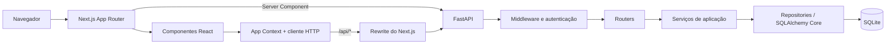

# Vértice Barbearia

Sistema full stack para operação local de uma barbearia: apresentação institucional, agendamento público, cálculo de disponibilidade, autenticação da equipe e painel administrativo com agenda, clientes e indicadores financeiros.

O projeto combina uma interface responsiva em Next.js com uma API FastAPI e persistência SQLite. A arquitetura foi construída para preservar consistência em reservas concorrentes, privacidade dos clientes, histórico de preços e uma integração tipada entre frontend e backend.


## Visão geral

A aplicação atende dois públicos:

- **Clientes:** conhecem os serviços e profissionais, escolhem data e horário e confirmam uma reserva sem criar uma conta.
- **Equipe:** entra com uma sessão validada no servidor e acompanha agenda, clientes, status dos atendimentos e faturamento.

Todo o sistema foi projetado para funcionar em um único computador Windows. O banco operacional fica fora do OneDrive, em `%LOCALAPPDATA%\VerticeBarbearia\data` por padrão.

### Funcionalidades

- Home institucional responsiva com serviços, equipe, espaço e chamadas para agendamento.
- Fluxo de reserva em múltiplas etapas, com seleção de serviços e profissional.
- Opção **sem preferência**, que atribui atomicamente o primeiro profissional disponível.
- Calendário e horários calculados de acordo com duração, expediente e sobreposições.
- Confirmação idempotente, segura contra reenvios e cliques repetidos.
- Autenticação da equipe com Argon2, cookie HttpOnly e sessão de oito horas.
- Painel com agenda, busca de clientes, filtros e alteração de status.
- Indicadores de atendimentos, faturamento e ticket médio.
- Persistência histórica de nome, preço e duração dos serviços reservados.
- Backup e restauração verificados do SQLite.
- Estados de carregamento, erro, vazio e sucesso em todas as integrações relevantes.

## Tecnologias

### Frontend

| Tecnologia         | Aplicação no projeto                                            |
| ------------------ | --------------------------------------------------------------- |
| **Next.js 16**     | App Router, Server Components, rotas e proxy interno para a API |
| **React 19**       | Componentes interativos, fluxo de reserva e painel              |
| **TypeScript 6**   | Tipagem estrita, contratos do frontend e validação de respostas |
| **Tailwind CSS 4** | Pipeline PostCSS e utilitários pontuais                         |
| **CSS semântico**  | Design system global, responsividade, estados e acessibilidade  |
| **Context API**    | Catálogo, sessão, rascunho, etapa e confirmação da reserva      |
| **Fetch API**      | Cliente HTTP nativo com timeout e cancelamento                  |
| **next/image**     | Otimização e estabilidade visual das imagens locais             |
| **Lucide React**   | Ícones consistentes e acessíveis                                |

### Backend

| Tecnologia            | Aplicação no projeto                                                    |
| --------------------- | ----------------------------------------------------------------------- |
| **Python 3.14**       | Runtime do ambiente local atual; o código é compatível com Python 3.11+ |
| **FastAPI**           | API HTTP, injeção de dependências e documentação OpenAPI                |
| **Pydantic**          | Validação estrita de entradas e respostas                               |
| **Uvicorn**           | Servidor ASGI local                                                     |
| **SQLAlchemy Core 2** | Schema, consultas explícitas e transações                               |
| **SQLite**            | Persistência local de catálogo, reservas, usuários e sessões            |
| **Alembic**           | Migrações versionadas do banco                                          |
| **Argon2**            | Hash seguro das senhas da equipe                                        |
| **zoneinfo / tzdata** | Regras temporais em `America/Sao_Paulo`                                 |

### Qualidade e ferramentas

| Tecnologia          | Responsabilidade                                           |
| ------------------- | ---------------------------------------------------------- |
| **Vitest 5**        | Testes de comportamento do frontend                        |
| **Testing Library** | Interações e consultas orientadas à experiência do usuário |
| **jsdom**           | Ambiente DOM dos testes React                              |
| **Pytest**          | Testes da API, domínio, concorrência e CLI                 |
| **pytest-cov**      | Cobertura com mínimo configurado de 90%                    |
| **Ruff**            | Lint e formatação Python                                   |
| **mypy**            | Verificação estática do backend                            |
| **ESLint 9**        | Regras Next.js, React e TypeScript                         |
| **Prettier 3**      | Formatação do frontend                                     |
| **pip-tools**       | Locks reproduzíveis das dependências Python                |

## Arquitetura



### Frontend

- `src/app/` contém layout, páginas, metadados e estilos globais.
- `src/components/` reúne shell, agendamento, login, animações e painel.
- `src/context/app-context.tsx` preserva catálogo, sessão e continuidade do fluxo entre navegações.
- `src/lib/api.ts` define tipos, cliente HTTP e validadores para respostas desconhecidas.
- `src/assets/` contém as imagens locais e os prompts que documentam sua origem.

As páginas permanecem Server Components quando possível. A home consulta o catálogo pelo endereço interno da API; componentes interativos usam `/api`, encaminhado pelo Next.js ao FastAPI.

O estado do agendamento não é salvo em `localStorage` ou `sessionStorage`. Navegar entre as páginas preserva o fluxo porque o provider está no layout compartilhado; recarregar a aba reinicia o rascunho.

### Backend

O backend separa responsabilidades em camadas:

| Camada            | Responsabilidade                                         |
| ----------------- | -------------------------------------------------------- |
| `main.py`         | Composição da aplicação, engine, relógio e ciclo de vida |
| `config.py`       | Leitura e validação das configurações de ambiente        |
| `routers/`        | Contrato HTTP e injeção de dependências                  |
| `schemas.py`      | Modelos Pydantic de entrada e saída                      |
| `services.py`     | Regras de negócio, agenda, autenticação e reservas       |
| `repositories.py` | Consultas SQL e serialização de reservas                 |
| `db.py`           | Tabelas, índices, constraints e engine SQLite            |
| `http.py`         | Middleware, erros públicos, cabeçalhos e logs            |
| `cli.py`          | Migrações, seed, usuários, backup e restauração          |

O engine e o relógio podem ser injetados em testes. O FastAPI encerra o engine criado pela própria aplicação durante o shutdown.

## Modelo de dados

| Tabela              | Conteúdo e relacionamento                                      |
| ------------------- | -------------------------------------------------------------- |
| `services`          | Catálogo atual, preço em centavos e duração                    |
| `barbers`           | Profissionais, especialidades, avaliação e posição             |
| `appointments`      | Reserva, cliente, profissional, data, horário, totais e status |
| `appointment_items` | Snapshot dos serviços vinculados a cada reserva                |
| `users`             | Usuários da equipe e hashes Argon2                             |
| `sessions`          | Hash do token, usuário e instante de expiração                 |

Valores monetários são armazenados em centavos. Cada reserva mantém snapshots de nome, preço e duração dos serviços; mudanças futuras no catálogo não alteram o histórico.

O SQLite usa conexões curtas com `NullPool`, chaves estrangeiras habilitadas e espera de bloqueio de até cinco segundos. Criações e reativações usam `BEGIN IMMEDIATE`, impedindo que duas operações concorrentes confirmem o mesmo profissional no mesmo intervalo.

## Fluxo de uma requisição

1. O navegador chama `/api` no mesmo domínio do frontend.
2. O Next.js encaminha a requisição para o FastAPI em `127.0.0.1:8000`.
3. O middleware cria um identificador, aplica política de origem quando necessário e mede a duração.
4. O router valida parâmetros, body, headers e dependências.
5. O serviço aplica as regras de negócio.
6. O repository executa consultas parametrizadas no SQLite.
7. O Pydantic valida o formato público da resposta.
8. O middleware adiciona cabeçalhos defensivos e registra apenas metadados seguros.

Toda resposta recebe:

- `X-Request-ID` para correlação operacional;
- `Cache-Control: no-store`;
- `X-Content-Type-Options: nosniff`;
- `Referrer-Policy: no-referrer`.

Os logs registram rota, método, status e duração, sem payload, telefone, senha, cookie ou observação do cliente.

## Como cada GET funciona

### `GET /`

Retorna uma confirmação simples de que o processo FastAPI está ativo:

```json
{
  "status": "ok",
  "message": "API da barbearia funcionando"
}
```

Não consulta nem cria o banco. Portanto, pode responder mesmo antes da inicialização do SQLite.

### `GET /favicon.ico`

Serve diretamente `backend/app/static/favicon.ico` como `image/x-icon`. A rota não acessa o banco e não aparece no schema OpenAPI.

### `GET /api/health`

Executa uma consulta mínima na tabela `services`:

```sql
SELECT services.id FROM services LIMIT 1;
```

O objetivo é confirmar que o banco pode ser aberto e que o schema foi inicializado. Uma tabela vazia ainda é considerada saudável. Banco ausente, bloqueado ou sem a tabela esperada produz `503 Service Unavailable` com uma mensagem pública estável.

### `GET /api/catalog`

Endpoint público consumido pela home e pelo fluxo de agendamento.

1. Abre uma conexão curta.
2. Carrega os serviços.
3. Carrega os profissionais ordenados por `position`.
4. Converte campos internos, como `price_cents`, para o contrato `priceCents`.
5. Valida a resposta com `CatalogOutput`.
6. Fecha a conexão.

Resposta resumida:

```json
{
  "services": [
    {
      "id": "corte",
      "name": "Corte de cabelo",
      "description": "Seu estilo, na medida certa.",
      "icon": "scissors",
      "priceCents": 6000,
      "duration": 40
    }
  ],
  "barbers": [
    {
      "id": "rafael",
      "name": "Rafael Costa",
      "specialty": "Clássicos & tesoura",
      "rating": "4,9"
    }
  ]
}
```

Os profissionais têm ordenação explícita. A consulta dos serviços não define `ORDER BY`, portanto sua ordem não faz parte do contrato SQL.

### `GET /api/availability`

Exemplo com um serviço:

```text
/api/availability?date=2030-01-07&barber=rafael&services=corte
```

Para múltiplos serviços, o parâmetro é repetido:

```text
/api/availability?date=2030-01-07&barber=any&services=corte&services=sobrancelha
```

Processamento:

1. Valida se os serviços existem, não estão duplicados e formam uma combinação permitida.
2. Resolve o profissional informado ou todos os candidatos quando `barber=any`.
3. Soma a duração dos serviços.
4. Carrega, em uma única consulta, os intervalos ocupados naquela data.
5. Avalia os inícios disponíveis entre 09:00 e 17:30, em passos de 30 minutos.

Um horário só é retornado quando:

- não é domingo;
- não está no passado;
- se for hoje, começa depois do horário atual;
- o atendimento termina até 19h;
- pelo menos um profissional candidato está livre durante toda a duração.

A sobreposição é calculada por intervalos, permitindo atendimentos adjacentes. Reservas canceladas são ignoradas.

```json
{
  "slots": ["09:00", "09:30", "11:00"]
}
```

A resposta nunca contém nome, telefone, observação ou código de reserva. Como outro cliente pode reservar entre esta consulta e a confirmação, o POST repete a validação dentro de uma transação com bloqueio de escrita.

### `GET /api/appointments`

Consulta autenticada da agenda:

```text
/api/appointments?start=2030-01-07&end=2030-01-10
```

Filtro opcional por profissional:

```text
/api/appointments?start=2030-01-07&end=2030-01-10&barber=rafael
```

Antes da consulta, a dependência de autenticação:

1. lê o cookie `vertice-session`;
2. calcula o SHA-256 do token;
3. procura o hash na tabela `sessions`;
4. verifica se `expires_at` ainda está no futuro;
5. retorna o usuário ou responde `401 Unauthorized`.

A agenda valida as datas, confirma o profissional opcional e ordena reservas por data e horário. Os itens são carregados em lote e agrupados em memória, evitando uma consulta adicional por reserva.

Uma resposta autenticada contém dados pessoais e snapshots históricos:

```json
[
  {
    "id": "VT-ABC123",
    "services": ["corte"],
    "barber": "rafael",
    "date": "2030-01-07",
    "time": "09:00",
    "name": "Cliente",
    "phone": "11987654321",
    "note": "",
    "status": "confirmado",
    "totalCents": 6000,
    "duration": 40,
    "items": [
      {
        "id": "corte",
        "name": "Corte de cabelo",
        "priceCents": 6000,
        "duration": 40
      }
    ]
  }
]
```

O código rejeita períodos invertidos e diferenças superiores a 31 dias. Como as duas extremidades são inclusivas, uma diferença exata de 31 dias pode abranger 32 datas de calendário.

### `GET /api/auth/me`

Consulta o estado da sessão usando apenas o cookie HttpOnly. Quando válida, retorna:

```json
{
  "username": "equipe"
}
```

Cookie ausente, inválido ou expirado gera `401`. A consulta não renova a duração da sessão; o vencimento continua fixo a partir do login.

## Endpoints da API

| Método e caminho                        | Acesso  | Responsabilidade                         |
| --------------------------------------- | ------- | ---------------------------------------- |
| `GET /`                                 | Público | Confirma que o FastAPI está respondendo  |
| `GET /favicon.ico`                      | Público | Serve o ícone local do backend           |
| `GET /api/health`                       | Público | Verifica acesso ao banco inicializado    |
| `GET /api/catalog`                      | Público | Retorna serviços e profissionais         |
| `GET /api/availability`                 | Público | Calcula horários sem expor clientes      |
| `POST /api/appointments`                | Público | Cria uma reserva idempotente             |
| `GET /api/appointments`                 | Equipe  | Consulta agenda e dados dos clientes     |
| `PATCH /api/appointments/{code}/status` | Equipe  | Atualiza o status de uma reserva         |
| `POST /api/auth/login`                  | Público | Valida credenciais e cria a sessão       |
| `GET /api/auth/me`                      | Equipe  | Consulta a sessão atual                  |
| `POST /api/auth/logout`                 | Público | Revoga a sessão do cookie, quando existe |

Com o backend iniciado, os contratos interativos ficam disponíveis em `http://127.0.0.1:8000/docs`.

## Reservas, autenticação e consistência

### Criação de reserva

`POST /api/appointments` recebe:

```json
{
  "services": ["corte"],
  "barber": "any",
  "date": "2030-01-07",
  "time": "09:00",
  "name": "Cliente Teste",
  "phone": "11987654321",
  "note": ""
}
```

A requisição exige `Idempotency-Key` entre 16 e 100 caracteres. A mesma chave com o mesmo payload retorna a reserva criada anteriormente. Reutilizar a chave com outro payload gera `409 Conflict`.

Dentro de `BEGIN IMMEDIATE`, a API:

- valida serviços, profissional, data e horário;
- verifica sobreposição novamente;
- resolve `any` pelo primeiro profissional livre na ordem configurada;
- gera um código `VT-XXXXXX`;
- grava a reserva e os snapshots dos serviços na mesma transação.

### Status

Os estados válidos são:

- `confirmado`;
- `em atendimento`;
- `concluído`;
- `cancelado`.

Cancelar libera o intervalo. Reativar uma reserva cancelada executa uma nova verificação transacional e é recusado se outra reserva passou a ocupar o horário.

### Sessões

As senhas são verificadas com Argon2. Mesmo quando o usuário não existe, o backend verifica um hash falso para reduzir diferenças temporais observáveis.

No login, a API gera um token aleatório, salva apenas seu SHA-256 e envia o valor original em cookie:

- `HttpOnly`;
- `SameSite=Strict`;
- `Path=/`;
- validade padrão de oito horas;
- `Secure` configurável para ambientes HTTPS.

O logout remove a sessão do banco e apaga o cookie.

## Decisões de engenharia

- **Idempotência:** protege contra repetição de confirmação após falha de rede ou clique duplicado.
- **Concorrência:** `BEGIN IMMEDIATE` transforma a verificação e gravação em uma operação atômica.
- **Histórico:** snapshots impedem que mudanças no catálogo alterem reservas antigas.
- **Privacidade:** disponibilidade pública retorna somente horários; agenda exige sessão real.
- **Segurança de sessão:** cookie HttpOnly e tokens armazenados somente como hash.
- **Origem confiável:** métodos que alteram estado exigem uma origem configurada.
- **Validação nos dois lados:** Pydantic valida a API e o frontend verifica respostas `unknown` antes de usá-las.
- **Consultas em lote:** agenda e disponibilidade evitam N+1 e carregamentos repetidos.
- **Testabilidade:** engine e relógio são substituíveis; testes nunca usam o banco operacional.
- **Observabilidade segura:** request IDs e logs estruturados sem informações pessoais.

O código de confirmação identifica o atendimento, mas não funciona como credencial e não permite consultar publicamente os dados da reserva.

## Rotas do frontend

| Rota       | Experiência                                                        |
| ---------- | ------------------------------------------------------------------ |
| `/`        | Apresentação, serviços, profissionais e espaço                     |
| `/agendar` | Serviços, profissional, calendário, horário, cliente e confirmação |
| `/login`   | Autenticação da equipe                                             |
| `/painel`  | Agenda, clientes, faturamento, filtros e status                    |

Faturamento, ticket médio e comparação com o dia anterior são calculados no frontend a partir das reservas concluídas retornadas pela agenda. Não existe um endpoint separado de analytics.

## Como executar

### Pré-requisitos

- Windows com PowerShell;
- Node.js 24 e npm;
- Python 3.11 ou superior — ambiente atual validado com Python 3.14.

### Instalação

Na raiz do projeto:

```powershell
npm.cmd ci
python -m venv backend/.venv
backend/.venv/Scripts/python.exe -m pip install -r backend/requirements.txt
Set-Location backend
.venv/Scripts/python.exe -m app.cli init
.venv/Scripts/python.exe -m app.cli user --username equipe
Set-Location ..
```

O comando `user` solicita uma senha de 12 a 1024 caracteres sem exibi-la. Não existe senha padrão e o comando não substitui usuários existentes.

`init` aplica todas as migrações e insere somente o catálogo e os profissionais ausentes. Pode ser executado novamente sem sobrescrever preços e sem criar reservas fictícias.

Para desenvolvimento do backend, instale `backend/requirements-dev.txt` no lugar de `backend/requirements.txt`.

### Operação local

```powershell
.\scripts\start-local.ps1
# Depois de um build já atualizado:
.\scripts\start-local.ps1 -SkipBuild

.\scripts\stop-local.ps1
```

Acesse `http://127.0.0.1:3000`.

Os scripts iniciam os processos ocultos em loopback, verificam `/api/health` e registram logs em `.local-run/`. O script de parada encerra somente os processos registrados e seus filhos, validando o instante de criação para evitar reutilização incorreta de PID.

### Desenvolvimento

Use dois terminais a partir da raiz:

```powershell
# Terminal 1 — API
Set-Location backend
.venv/Scripts/python.exe -m uvicorn app.main:app --host 127.0.0.1 --port 8000 --reload --no-access-log
```

```powershell
# Terminal 2 — frontend
npm.cmd run dev -- --hostname 127.0.0.1
```

Encerre os servidores com `Ctrl+C`.

## Configuração

| Variável                        | Processo      | Padrão                                                   |
| ------------------------------- | ------------- | -------------------------------------------------------- |
| `API_INTERNAL_URL`              | Next.js       | `http://127.0.0.1:8000`                                  |
| `BARBEARIA_DB_PATH`             | FastAPI e CLI | `%LOCALAPPDATA%\VerticeBarbearia\data\barbearia.sqlite3` |
| `BARBEARIA_ORIGINS`             | FastAPI       | `http://127.0.0.1:3000,http://localhost:3000`            |
| `BARBEARIA_SESSION_TTL_SECONDS` | FastAPI       | `28800`                                                  |
| `BARBEARIA_COOKIE_SECURE`       | FastAPI       | `false`                                                  |

O backend lê as variáveis do processo e não carrega `.env` automaticamente. Exemplo:

```powershell
$env:BARBEARIA_DB_PATH = 'C:\pasta-local\barbearia.sqlite3'
```

Use o mesmo ambiente nos comandos de migração, backup e servidor.

### Deploy isolado do FastAPI na Vercel

Crie um projeto separado na Vercel com **Root Directory** definido como `backend`. O runtime
reconhece `app/main.py` automaticamente e instala as dependências de produção a partir de
`requirements.txt`; mantenha Build Command, Install Command e Output Directory sem sobrescritas.

Configure no projeto do backend:

```text
BARBEARIA_ORIGINS=https://barbearia2-nine.vercel.app
BARBEARIA_COOKIE_SECURE=true
```

Depois do deploy, configure `API_INTERNAL_URL` no projeto do frontend com a URL HTTPS pública do
backend. Essa configuração corrige o empacotamento e a inicialização da aplicação, mas não torna o
SQLite persistente: Vercel Functions oferecem somente `/tmp` como área gravável, e seu conteúdo é
efêmero. As rotas que consultam ou alteram catálogo, reservas, usuários e sessões exigem uma etapa
posterior de persistência compatível com serverless ou uma hospedagem com disco persistente.

## Testes e qualidade

Frontend, a partir da raiz:

```powershell
npm.cmd run test
npm.cmd run lint
npm.cmd run typecheck
npm.cmd run build
```

Backend, dentro de `backend/`:

```powershell
.venv/Scripts/python.exe -m pytest tests -q
.venv/Scripts/python.exe -m pytest tests --cov=app --cov-report=term-missing -q
.venv/Scripts/python.exe -m ruff check app migrations tests
.venv/Scripts/python.exe -m ruff format --check app migrations tests
.venv/Scripts/python.exe -m mypy app
```

Os testes do backend usam bancos temporários, relógio controlado e conexões independentes. A suíte cobre:

- contratos e validações;
- persistência e snapshots históricos;
- concorrência e sobreposição;
- idempotência;
- autenticação, expiração e privacidade;
- consultas em lote;
- migrações e constraints;
- cabeçalhos e logs;
- CLI, backup e restauração.

Os testes Vitest usam mocks HTTP e nunca dependem do banco operacional.

## Backup e restauração

Dentro de `backend/`:

```powershell
.venv/Scripts/python.exe -m app.cli backup --file C:\Backups\barbearia.sqlite3
```

O backup usa `sqlite3.Connection.backup`, funciona com o servidor ativo, verifica a integridade e recusa sobrescrever um arquivo existente.

Para restaurar:

1. Pare os dois servidores.
2. Arquive o banco operacional atual fora do caminho configurado.
3. Execute:

```powershell
.venv/Scripts/python.exe -m app.cli restore --file C:\Backups\barbearia.sqlite3
.venv/Scripts/python.exe -m app.cli init
```

A restauração também exige que o destino não exista; o comando não apaga automaticamente o banco anterior.

## Estrutura principal

```text
src/
├── app/                 # páginas, layout, metadados e CSS global
├── components/          # shell, agendamento, login e painel
├── context/             # estado compartilhado e continuidade do fluxo
├── lib/                 # cliente HTTP, tipos e validadores
├── data/                # apresentação e fixtures legadas de teste
└── assets/              # imagens locais e prompts

backend/
├── app/
│   ├── routers/         # endpoints HTTP
│   ├── main.py          # composição do FastAPI
│   ├── services.py      # regras de negócio
│   ├── repositories.py  # consultas SQL
│   ├── schemas.py       # contratos Pydantic
│   ├── db.py            # schema e engine
│   └── cli.py           # manutenção local
├── migrations/          # revisões Alembic
└── tests/               # testes isolados do backend
```

## Limitações e próximos passos

Esta versão não possui:

- pagamentos online;
- envio de mensagens ou lembretes;
- cadastro independente de clientes;
- editor administrativo do catálogo;
- níveis diferentes de permissão entre usuários da equipe;
- implantação pública pronta para produção.

A configuração atual usa HTTP e cookie sem `Secure` por padrão porque o sistema opera apenas em loopback. Uma publicação na internet exige HTTPS, cookie seguro, revisão de origens, política de implantação, gestão de segredos, estratégia de backup remoto e monitoramento externo.

---

Projeto desenvolvido para demonstrar arquitetura full stack, consistência transacional, integração tipada, segurança de sessão, testes automatizados e cuidado com experiência do usuário em um domínio real de agendamento.
